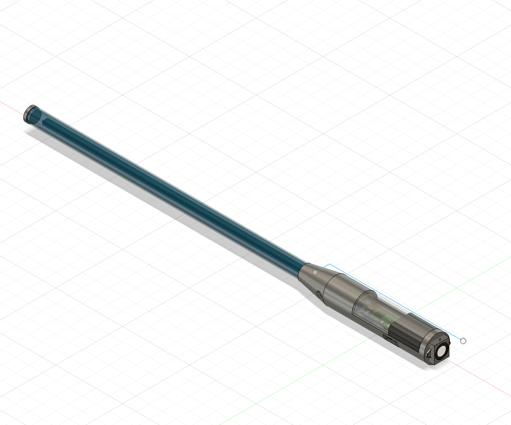

Cary Xiao: caryxiao@stanford.edu \
Ekin Tiu: ekintiu@stanford.edu

# CS140E Final Project: Lightsaber!

For our final project, we created a lightsaber prototype. On top of using various lab code to implement certain features, We also implemented a networked bootloader and PWM code to wirelessly send code to the lightsaber and to play sound while polling from the gyroscope, respectively.

## Overall Design

As an overview of the lightsaber itself, we designed and 3D-printed a hilt on top of a 24-inch plexiglass tube. We continuously sample from a gyroscope to determine the acceleration of the blade and use that information to determine how loud the sound of the lightsaber should play. Furthermore, we keep track of the direction of acceleration on the lightsaber, and if the direction suddenly changes, we detect that as a collision and briefly change the sound of the lightsaber accordingly.

## Networked Bootloader

As seen in the photo above, our goal was to have the lightsaber powered directly by batteries. However, because most of our lab code uses UART to send code to the r/pi to run programs, we either needed to change the bootloader to statically run our lightsaber code, or we would need to send program information wirelessly using the nrf receivers. We decided to go with the latter option, as this would allow us to quickly change the code running on the lightsaber and speed up our debugging process without having to re-compute and replace the `kernel.img` file that's in the SD card of the lightsaber's r/pi.

### Method

To implement the networked bootloader, we decided to use two r/pis: one connected to a computer via UART, and the second powered wirelessly that would get the code. Because of this, we send _two_ programs to the first r/pi using a modified `my-install` called `my-install-relay` (in `final-project/nrf-bootloader/1-unix-side/`). Aside from concatenating the two programs, `my-install-relay` also sends a `uint32_t` directly before the second message to indicate to the first r/pi how long the second program is.

The first r/pi then runs the first program that is sent, `relay.bin` (in `nrf-bootloader/3-relay/`). This program then locates the start of the second program, finds the size of the array, then moves the entire program into the heap before using NRF to send the program and its size to the second r/pi.

Finally, the second r/pi has a modified bootloader (see `nrf-bootloader/2-pi-side/`) that uses NRF instead of UART in `get-code.h`. When the first r/pi sends the code, the second r/pi is able to pick it up, move it to `0x8000`, and then run the program by calling `BRANCHTO(ARM_BASE)`.

### Difficulties

A notable issue we had was figuring out how reliably find the start of the second program on the first r/pi. While this sounds relatively simple by looking at the address `__prog_end__ + 4`. Our current understanding is that `__prog_end__` is set to `ARM_BASE` size of the first program, rounded up to the nearest power of 8, plus 16. However, if the program size is a multiple of 32, then `__prog_end__` is set to `ARM_BASE` plus the size of the first program.

We also had an issue with sending the code to the second r/pi. This is because the second program is initially in "free" memory, which is the reason why we first put it into an allocated space on the heap. However, something we realized is that we needed to first copy it to the stack before allocating the requisite amount from the heap. We found out that if we were to try copying directly from the heap, the system would directly allocate the space we were trying to preserve, zeroing out all the values. Thus, we copied it to the stack, then moved it to the heap so that it would be preserved across function calls.

### Testing and Debugging

To test our nrf bootloading, we created two methods to either test the functionality or debug output:

1. `nrf-bootloader-test.c` (in `nrf-bootloader/3-relay`). This test requires two r/pis with the original UART functionality and uses the first r/pi to send `hello-f.bin` to the second r/pi, which then copies the program into memory and attempts to run it via a `BRANCHTO`. Please see the file for more information about how to run it.

2. `pi-echo.c` (in `nrf-bootloader/1-unix-side`). This modified version of `my-install` enables you to see output from the second r/pi after you change the bootloader to use NRF. We used this program to debug our modified `get-code.c` and ensure that it correctly got programs, ran them, and either restarted or waited for another program.

## I2S

In order to make a "realistic" lightsaber, we wanted to incorporate some aspect of audio. In particular, our goal was to be able to play lightsaber audio noises stored as .WAV files. To do so, we started by trying to implement the I2S protocol detailed in Parthiv's lab (https://github.com/dddrrreee/cs240lx-22spr/tree/main/labs/17-i2s) as the first step. This primarily consisted of initializing I2S by configuring both the I2S peripheral and the clock manager registers in Section 6.3 of the Peripherals manual. We then implemented a `send_sample` function and `read_sample` function aiming to use both TX and RX capabilities of I2S. At this point, we ran into several difficulties.

### Difficulties

1. Our first problem was in debugging the I2S initialization protocol. While we had configured the I2S peripherals correctly, we found that a minor order of operations discrepancy when setting the Clock Manager prevented data from reaching the FIFO.
2. The second and primary difficulty was getting samples to send. After implementing `send_sample`, we found that the TX FIFO was always full, and thus would not send the data to the I2S receiver device.
3. In an attempt to debug with Parthiv, although we did not need the microphone, we tried to get proper readings from RX to distinguish if the issue was with our code, or our hardware. We soon found that the Adafruit microphone I2S setup worked, but the hardware device (RPI Codec Zero) did not give any readings. It did not take long for us to realize the Codec Zero which used a Dialog Semiconductor DA7212 Codec had its own datasheet (obfuscated by the fact that the Codec Zero datasheet was only 5 pages long, we had to figure out what codec it actually used in order to find the real datasheet).

In summary, since even I2S RX would be relatively tricky to figure out with our hardware, we figured getting TX to work with this hardware would be even trickier. In order to avoid a major bottleneck, we discussed with Joe and he suggested using PWM.

## PWM

PWM, or Pulse Width Modulation, is a means of emulating analog IO by setting the ratio (duty cycle) of when a pin is set on vs. off. This would allow us to play a given frequency, and therefore a set tone, on our speaker. We first started off experimenting with this method via software PWM to play a tone, then transitioned to using hardware PWM to play a tone, and eventually playing a `.WAV` file.

### Method

1. To use hardware PWM, we refer to section 9 in the ARM peripherals manual. We first had to set the proper function of PWM pin 18 (`GPIO_FUNC_ALT5`). Then, similar to I2S, we set the GPIO clock manager to operate using the 19.2MHz oscillator. We use a sampling frequency of around 44100 (44.1kHz is common sampling frequency for audio). We control this by setting the `range` of the PWM to `clock_rate` / `sampling_frequency`).
2. We then played a simple tone by writing to the `RNG1` (range) register and the `DAT1` (data) register. `DAT1` / `RNG1` should be a constant PWM frequency, so we are able to create a basic tone. This is done in `tests/play_tone.c`.
3. To get .WAV working, we use a description of the `.WAV` file format online to jump start the process (https://ccrma.stanford.edu/courses/422-winter-2014/projects/WaveFormat/#:~:text=A%20WAVE%20file%20is%20often,form%20the%20%22Canonical%20form%22.) We understood that getting `.WAV` to run should consist of iterating through each `.WAV` sample, and sending the corresponding frequency to the `PWM_FIFO`. For this, we additionally enable FIFO in the PWM `CTL` register, and write to `FIF1`. The first test is in `tests/play_wav.c`. Once we were able to play on wav file, we were able to use this code to bring everything together.

### Difficulties

1. The first difficulty was when setting PWM Peripherals registers, and understanding which mode to use. Thw PWM controller has two submodes where `MSEN=0` and `MSEN=1`. We were initially using `MSEN=0` as the this uses the default PWM algorithm. When reading through the datasheet, it was hard to distinguish the difference between the modes. One seemed to use N/M as the duty cycle, whereas the other described the same duty cycle using different letters M/S. For this, a friend who had taken the class last year was able to help out and suggested trying `MSEN=1`.
2. Playing the audio at the same time as the neopixel lights and gyroscope. During our first iteration, we tried to incorporate sending samples to the speaker within the same while loop as our gyro and setting lights. The issue here was that gyro and lights would take extra cycles, and since PWM is dependent on the timing of setting items in FIFO, we would get white noise. A semi-solution was to split the audio file into chunks, and play each chunk at a time. The tradeoff was an evident popping noise. Our solution to the popping was to increase the volume of the original .wav file so that the popping was less apparent. This gave it the illusion of concurrency!

Special shoutout to Joe Tan and Daniel Zamoschin (student in last year's class) who took the time to help us get through these difficulties.

## Designing the Hilt

While this is not necessarily related to computer systems, we did spend a non-negligible amount of time CADing and 3D-printing the hilt that housed all our devices. To see .obj and .stl files exported from Fusion 360

## Putting it Together

After implementing the individual components, we had to create a script that would incorporate all the APIs we had written thus far for each of the protocols. In particular, using the accelerometer and gyro to influence the light output of our neopixel light strip, while simulatenously getting audio to play.

# Additional Protocols

## I2C

Use repurpose code from the `labs/11-imu-i2c` lab.

## WS2812 (Neopixel)

Followed the lab in `extensions-devices/3-ws2812` to interface with the light strips.

## FAT32

Repurposed code from `labs/19-fat32-readonly` in order to read `.WAV` files from our filesystem into memory.
